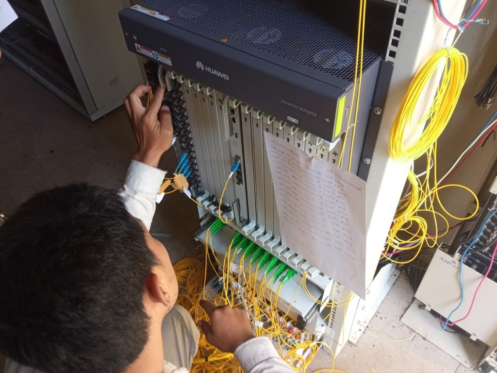
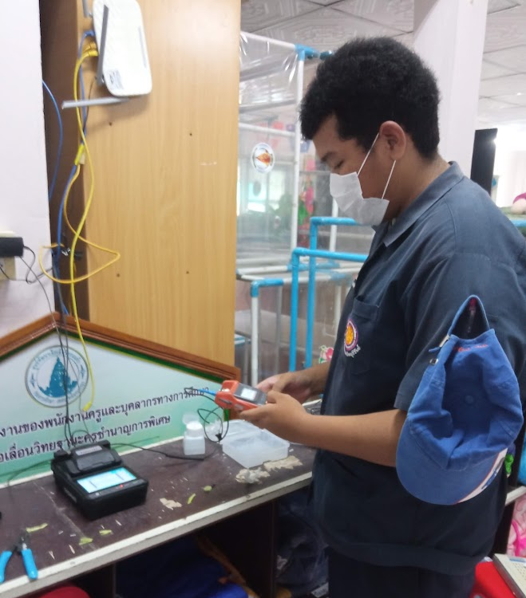
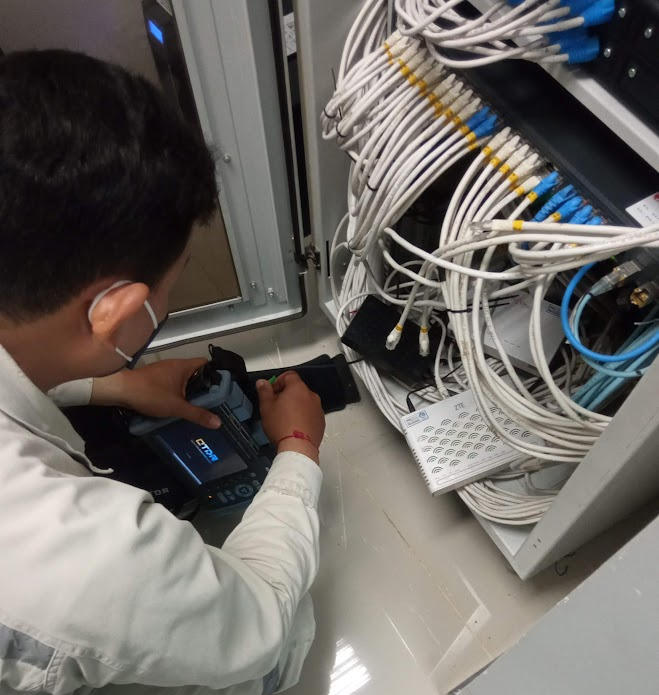
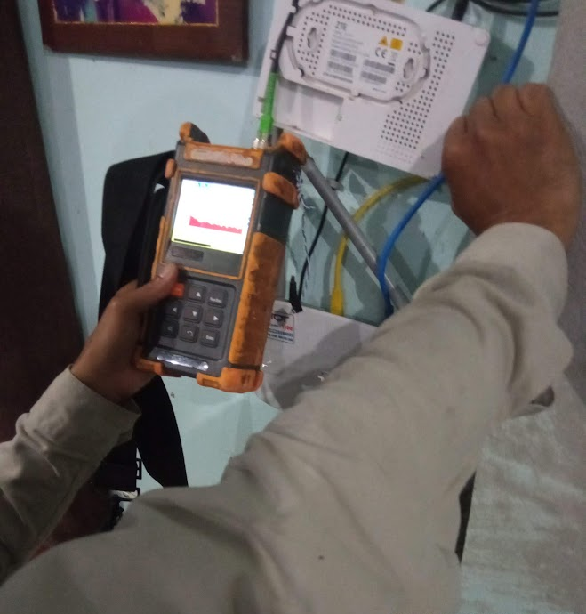

# Computer Network Labs

รวมงานแลปวิชาเครือข่ายคอมพิวเตอร์ (Cisco Packet Tracer) และภาพการฝึกงานภาคสนามด้านสายใยแก้วนำแสงที่ บมจ.โทรคมนาคมแห่งชาติ (NT)

---

## ประสบการณ์ฝึกงานภาคสนาม (NT นางรอง)

ภาพช่วงฝึกงานช่างเทคนิคที่ บมจ.โทรคมนาคมแห่งชาติ (NT) สาขานางรอง จ.บุรีรัมย์ (พ.ค. – ก.ย. 2565 รวม 630 ชั่วโมง) ได้ออกหน้างานจริงเกี่ยวกับการเดินสายใยแก้วนำแสง การเชื่อมต่อสาย และการใช้เครื่องมือตรวจวัดสัญญาณ

### 1. ตู้ชุมสาย OLT (Huawei SmartAX MA5800)
ตรวจเช็กคู่สายและจัดสาย Patch Cord บนตู้ OLT เพื่อกระจายสัญญาณอินเทอร์เน็ต FTTx ตามพอร์ตต่างๆ

### 2. การเชื่อมต่อสายใยแก้วนำแสง (Fusion Splicer)
ปอกสาย เช็ดทำความสะอาด ตัดปลายแก้วด้วย Fiber Cleaver แล้วนำเข้าเครื่อง Fusion Splicer เพื่อหลอมเชื่อมสายใยแก้วนำแสง

### 3. การตรวจวัดสายสัญญาณ (OTDR และ Power Meter)
- **เครื่อง OTDR:** ใช้วัดระยะทางสาย ตรวจหาจุดสายขาด หรือจุดที่สัญญาณดรอปในเส้นทาง
- **เครื่องวัดสัญญาณแสง (Power Meter):** ตรวจเช็กความแรงสัญญาณ (dBm) ที่จุดแยกสายและหน้างานลูกค้าก่อนต่อเข้าเราเตอร์

| ใช้เครื่อง OTDR ตรวจหาจุดบกพร่องในสาย | วัดค่าสัญญาณแสงก่อนเข้าตัวรับปลายทาง |
|:---:|:---:|
|  |  |

---

## แลปเครือข่ายคอมพิวเตอร์ (Cisco Packet Tracer)

งานทดลองจำลองระบบเครือข่ายคอมพิวเตอร์ ทั้งเรื่อง IP Address, การแบ่ง Subnet, การตั้งค่า Switch/Router และ Routing

### หัวข้อที่ทำในแลป
- **IP Address & Subnetting:** คำนวณ IPv4, VLSM และแบ่งวงเครือข่าย
- **ตั้งค่าอุปกรณ์:** คอนฟิก Router, Switch, คอมพิวเตอร์ และ Server ผ่าน CLI
- **VLAN & Trunking:** แบ่ง VLAN บน Switch, ทำ Trunking และ Inter-VLAN Routing
- **Routing:** ตั้งค่า Static Route และ Dynamic Route
- **บริการเครือข่าย:** จำลองการตั้งค่า DHCP และ DNS Server

### รายการไฟล์แลป

| ชุดแลป | เนื้อหา | ไฟล์งาน (.pkt) |
|---|---|---|
| **Lab 1** | การต่อสายอุปกรณ์พื้นฐาน, ต่อคอมพิวเตอร์ และตั้งค่า IP เบื้องต้น | [LAB-1.1](labs/LAB-1.1.pkt) · [LAB-1.2](labs/LAB-1.2.pkt) · [LAB-1.3](labs/LAB-1.3.pkt) |
| **Lab 2** | ตั้งค่า Switch, แบ่ง VLAN และทำ Trunking | [LAB-2.1](labs/LAB-2.1.pkt) · [LAB-2.2](labs/LAB-2.2.pkt) · [LAB-2.3](labs/LAB-2.3.pkt) |
| **Lab 3** | ตั้งค่า Router, แบ่ง Subnet และทำ Routing ข้ามเครือข่าย | [LAB-3.1](labs/LAB-3.1.pkt) · [LAB-3.2](labs/LAB-3.2.pkt) |
| **Lab 4** | จำลองระบบเครือข่ายรวมหลายอุปกรณ์และบริการ | [LAB-4.1](labs/LAB-4.1.pkt) |

### วิธีเปิดใช้งาน
ดาวน์โหลดไฟล์นามสกุล .pkt แล้วเปิดด้วยโปรแกรม **Cisco Packet Tracer** (เวอร์ชัน 8.0 ขึ้นไป) เพื่อดูผังเชื่อมต่อและการตั้งค่าภายในของแต่ละแลป
